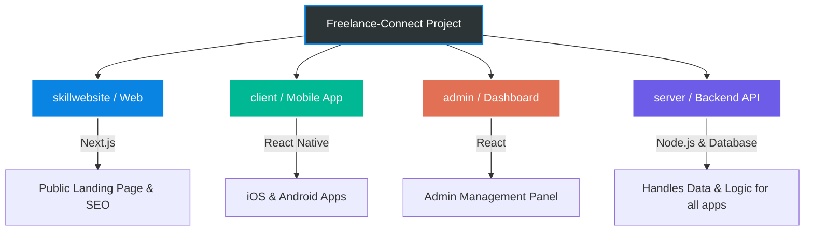
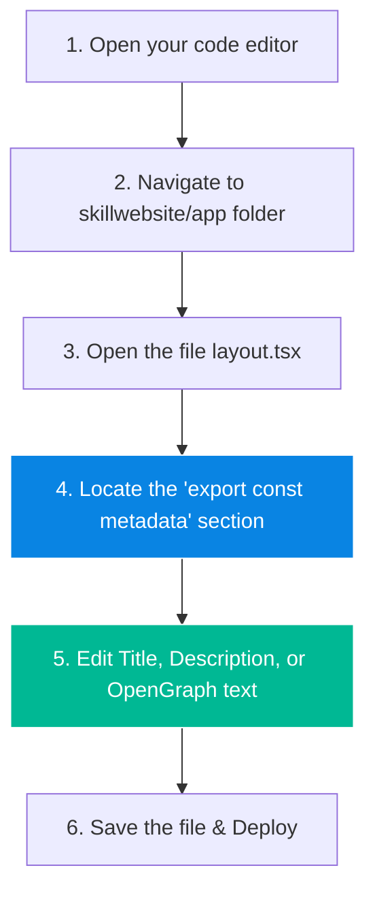

# 🚀 Skill Link: Project Structure & SEO Guide

Welcome to the **Skill Link** project! This guide is designed to help you understand how your project is structured and provide you with easy, step-by-step instructions on how to manage **Search Engine Optimization (SEO)** by yourself.

With this guide, you won't need to contact a developer for small SEO changes like updating page titles, descriptions, or social media sharing images.

---

## 🏗️ 1. Project Structure Overview

The **Skill Link** platform is a modern, modular application divided into four main parts. Here is how they all connect:



### Breakdown of Folders:
1. **`skillwebsite` (The Public Website):** This is your main landing page. **This is where all SEO happens.** It is built using a technology called Next.js, which is perfect for ranking high on Google.
2. **`client` (The Mobile App):** The actual mobile application (iOS and Android) used by freelancers and clients.
3. **`admin` (The Admin Panel):** The dashboard you use to manage users, view analytics, and control the platform.
4. **`server` (The Backend):** The brain of the application. It processes data, handles logins, and connects everything to the database.

---

## 🔍 2. How to Manage SEO By Yourself

SEO (Search Engine Optimization) controls how your website looks when people search for it on Google or share a link on platforms like Twitter, Facebook, or LinkedIn.

We have centralized your SEO settings so you only have to edit **one single file** to update your global SEO.

### 📍 Where to do SEO?
**File Location:** `skillwebsite/app/layout.tsx`

### 🔄 SEO Modification Flowchart



### 🛠️ Step-by-Step Instructions

1. Go to the folder: `skillwebsite/app/`
2. Open the file named `layout.tsx`.
3. Scroll to the top of the file (around line 15), and look for the `metadata` block that looks like this:

```javascript
export const metadata: Metadata = {
  title: {
    default: "Skill Link — Freelance marketplace", // <--- 1. UPDATE YOUR MAIN TITLE HERE
    template: "%s | Skill Link",
  },
  description:
    "Connect skilled professionals with hiring partners. Post jobs, showcase portfolios, message, and grow...", // <--- 2. UPDATE YOUR GOOGLE DESCRIPTION HERE
  openGraph: {
    title: "Skill Link — Freelance marketplace", // <--- 3. TITLE FOR FACEBOOK/LINKEDIN
    description:
      "Hire skilled people. Earn as a freelancer. Jobs, portfolios, and real-time collaboration.", // <--- 4. DESCRIPTION FOR FACEBOOK/LINKEDIN
    type: "website",
    locale: "en_US",
  },
  twitter: {
    card: "summary_large_image",
    title: "Skill Link — Freelance marketplace", // <--- 5. TITLE FOR TWITTER
    description:
      "Hire skilled people. Earn as a freelancer. Jobs, portfolios, and real-time collaboration.", // <--- 6. DESCRIPTION FOR TWITTER
  },
};
```

### 📝 What Each Field Means:
- **`title.default`**: The name of your site as it appears on Google and in the browser tab.
- **`description`**: The small paragraph of text that shows up below the title on Google searches. Try to keep this between 150-160 characters.
- **`openGraph`**: This controls how your link looks when shared on Facebook, LinkedIn, Discord, or iMessage.
- **`twitter`**: This controls how your link looks when shared on X (formerly Twitter).

### 🚀 How to Apply the Changes
Once you have modified the text inside the quotation marks `" "`:
1. **Save** the file.
2. Commit your changes to your Git repository (or ask your deployment service, like Vercel or Netlify, to rebuild).
3. The changes will automatically be live on your website and visible to Google!

> [!TIP]
> **Pro SEO Tip:** Always include your most important keywords in the `title.default` and the `description`. For example, words like "Freelance marketplace", "Hire professionals", and "Find jobs" are excellent for ranking!
